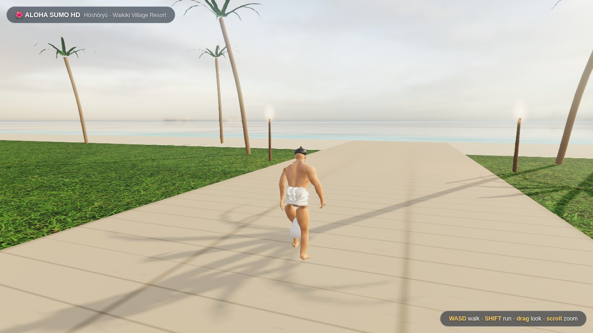
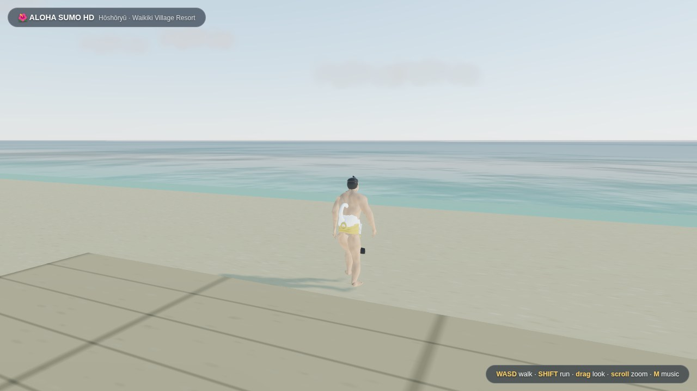
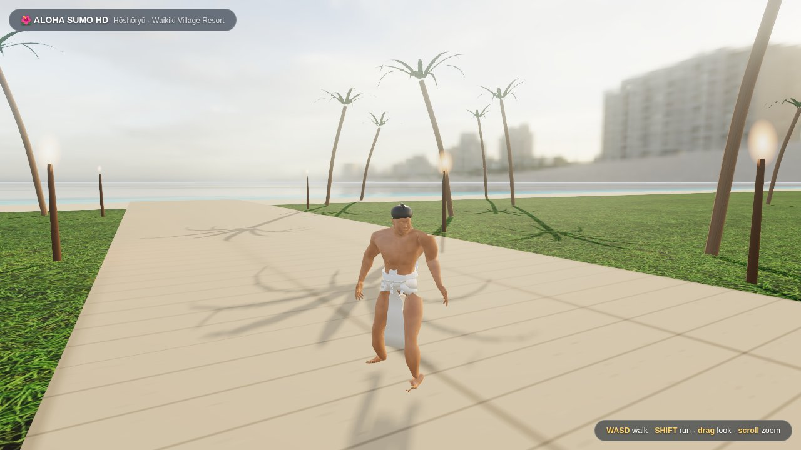

# 🌺 ALOHA SUMO HD — Hōshōryū at Waikiki

The **real hyperrealism pipeline**, built end-to-end with Blender + three.js:
a yokozuna (styled after Hōshōryū — athletic build, chonmage, white
keiko-mawashi with the tsuna rope) walking around the Waikiki Village Resort
at golden hour.

## ▶️ Play

Open `aloha-hd/index.html` in any modern browser. Fully self-contained —
the character, HDRI and textures are embedded in `bundle.js` (~14 MB).
**WASD** walk · **SHIFT** run · **drag** look · **scroll** zoom · **M** music.

**Music:** an original slack-key-style island instrumental plays by default
(synthesized live — any key starts it). To hear *Waimanalo Blues* instead,
drop a file you own named `waimanalo-blues.mp3` into this folder — the game
auto-detects and loops it.

## 🔬 How it was made (the actual pipeline)

1. **Character — Blender 5 + MPFB2 (MakeHuman).** A parametric human
   generated headlessly (`src/gen_sumo.py`): male, asian phenotype, max
   weight, high muscle, sumo belly morphs, with a **Mixamo-compatible
   52-bone rig** and skin weights. Procedural skin (tonal mottling + pores)
   baked to 2K diffuse + 1K normal maps with Cycles. Eyes, chonmage,
   three-wrap keiko-mawashi, front panel, and tsuna rope with shide are
   fitted in script (shrink-wrapped against an arms-removed torso copy).
2. **Animation — world-space constraint retargeting** (`src/gen_anims.py`):
   the three.js Soldier's mocap Idle/Walk/Run clips are baked bone-by-bone
   onto the sumo rig with visual keying, then exported inside the GLB.
3. **Rendering — three.js r160**: bright tropical-sky atmosphere shader
   driving both the backdrop and the image-based lighting (PMREM), trade-wind
   cumulus, ACES tone mapping, PCF soft shadows, reflective
   ocean (`Water` + real normal map), PBR grass texture, procedural palms,
   torches with real point lights, UnrealBloom + SMAA post-processing.
4. Bundled with esbuild; assets embedded as base64 so `file://` just works.

## Honest note on "insanely realistic"

The environment lighting/sky/water are photo-based and genuinely read as
Hawaii. The character is a realistic anatomical human with mocap movement —
a huge leap beyond stylized — but a true digital-double face (pore-level
scan, groomed hair) needs artist-made or photoscanned assets that no free
pipeline generates. Every knob to push further is in `src/`.
