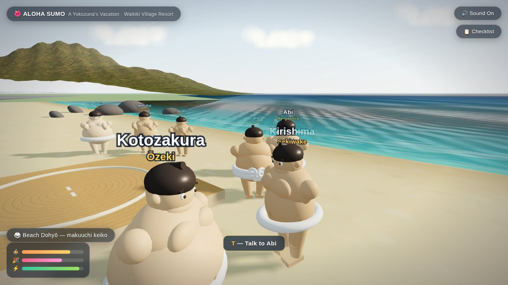
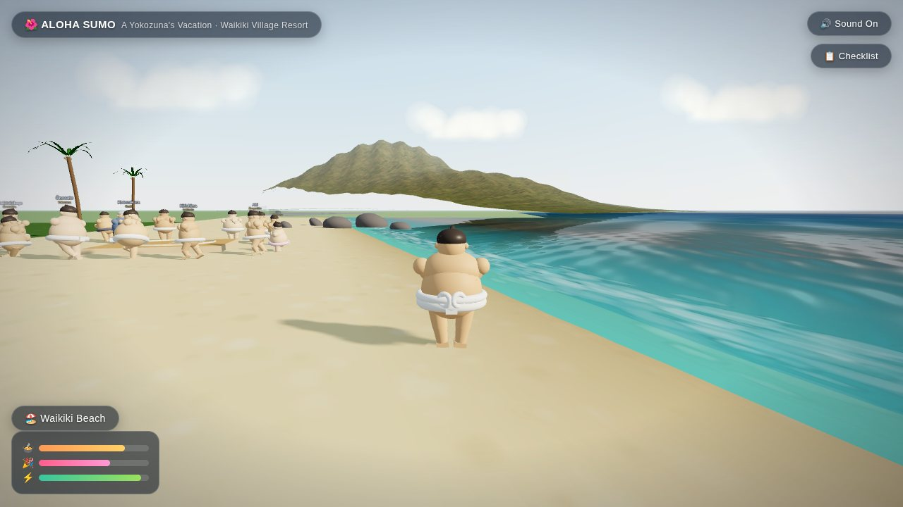
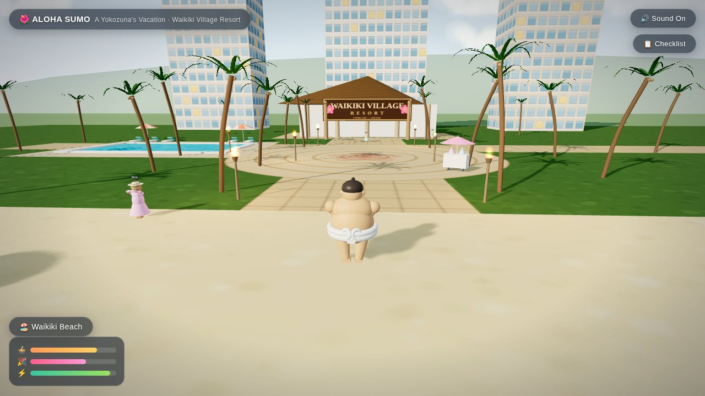
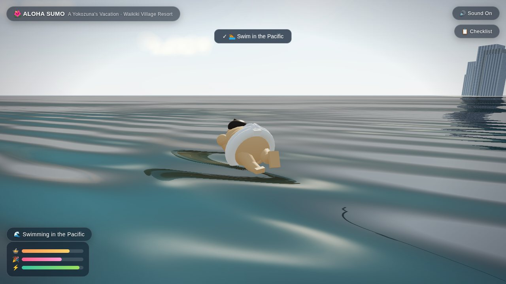

# 🌺 ALOHA SUMO — A Yokozuna's Vacation

A 3D life-sim in your browser: you are the **yokozuna** — white keiko-mawashi,
white **tsuna rope with shide** — on vacation at the Waikiki Village Resort on
Oʻahu, while the **makuuchi division holds an inter-stable beach practice** on a
sand dohyō, hosted by **Futagoyama-beya** and its oyakata.

Swim in the Pacific, eat chanko by the ring, hula at golden hour, jam ukulele,
talk to everyone, and stare at **Diamond Head** across the bay.

## ▶️ How to play

**No install, no build, no internet needed.** Open `sumo-waikiki/index.html`
in any modern browser (Chrome, Edge, Firefox, Safari) and click to begin.
Everything — Three.js, textures, characters, sounds — is local or generated
procedurally at runtime.

## 🎮 Controls

| Input | Action |
| --- | --- |
| `W A S D` / arrows | Walk (walk into deep water to **swim** — ocean or pool) |
| `SHIFT` | Run (drains ⚡) |
| `SPACE` | **Shiko stomp** — dust, thunder, camera shake |
| `E` | Interact: eat 🍧🍲🧃 / relax on a lounger |
| `T` | Talk to whoever's near |
| `U` | Play the **ukulele** (procedurally synthesized island chords) |
| `G` | **Hula dance** with drum + strings |
| `F` | Shout ALOHA! |
| `TAB` | Vacation checklist |
| Mouse drag / scroll | Camera / zoom · `M` mute · `R` back to plaza |

**Touch:** left-half joystick, right-half camera, plus ACT / STOMP / UKE / HULA buttons.

## 🩻 Sims-style needs

Three meters (bottom-left): **🍲 Ono (hunger) · 🎉 Fun · ⚡ Energy**.
Eat at the shave-ice cart, the chanko pot, or Lani's tiki bar; have fun by
dancing, jamming, swimming and talking story; recharge on a beach lounger.
Run them dry and the big man slows down, sulks, and refuses to run.

Complete every item on the **📋 checklist** (Tab) for the
🏆 *LIVING THE DREAM* banner.

## 🥋 The beach practice (degeiko)

A packed-clay dohyō sits on the sand with a straw-bale ring, shikiri lines, a
steaming **chanko-nabe station**, and a rotating schedule of real bouts:
tachi-ai charge → lock → drive → push-out → bow, cycling through pairs while
the rest do shiko, matawari stretches, and towel duty.

Present (name labels appear as you approach):

- **Futagoyama Oyakata** (ex-Ōzeki Miyabiyama) — coaching from the ring edge,
  occasionally shouting corrections.
- **Yoshii** — Futagoyama's man in the top division, training with the guests.
- Futagoyama tsukebito on chanko and towel duty.
- Visiting makuuchi: **Ōnosato, Kotozakura, Kirishima, Abi, Ura (pink mawashi),
  Tobizaru, Takerufuji, Atamifuji, Takayasu, Wakatakakage** — each with his own
  build and something to say.

> **Editing the roster:** rosters change every basho, so all names, ranks,
> builds and dialogue live in the `ROSTER` object at the **top of `game.js`**.
> Add or rename Futagoyama stablemates there — one line per wrestler.
> The player character is styled after the yokozuna Hōshōryū (athletic build,
> sharp brows, chonmage, white tsuna); it's a stylized fan tribute, and the
> `ROSTER.player` entry is just as editable.

## 🔧 Tech notes

- Three.js r128 vendored in `lib/` (plain script tags — works from `file://`).
- Planar-reflection ocean + tileable procedural normal map; turquoise-to-deep
  gradient shallows; animated surf foam and rolling swell sets; atmospheric-
  scattering sky with sun glare; trade-wind cumulus.
- Diamond Head is a heightfield sculpted to the real profile seen from Waikiki
  (long ridge to the 232 m peak, sea cliff, hidden crater bowl) with erosion-
  striation texturing, plus the lighthouse, Kapiolani park green, and a hazy
  hotel skyline curving up the coast behind you.
- Every human is one parameterized procedural rig (rikishi / aloha shirt /
  sundress / kimono) sharing a pose library: walk, shiko, crouch, tachi-ai
  drive, bow, stretch, hula, ukulele, eating, swimming, sunbathing.
- All audio synthesized live with WebAudio: ocean swells, gulls, stomps, bout
  clashes, munching, and a plucked-string ukulele playing C–G7–Am–F.
- Footprints in the sand, wading ripples, splash bursts, chanko steam,
  flickering tiki torches, circling gulls.
